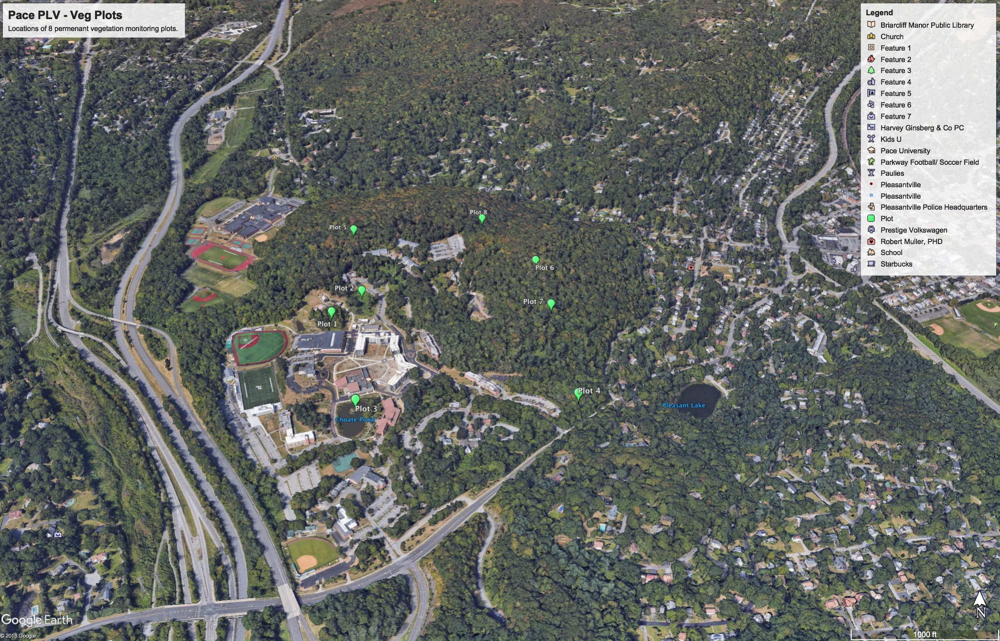

## Vegetation Monitoring Plot Setup - 1

We will begin to setup permanent vegetation monitoring plots. 
Our sampling scheme within the plots is outlined [here](sample_design.html).
Below is a map showing the position of the plots.

